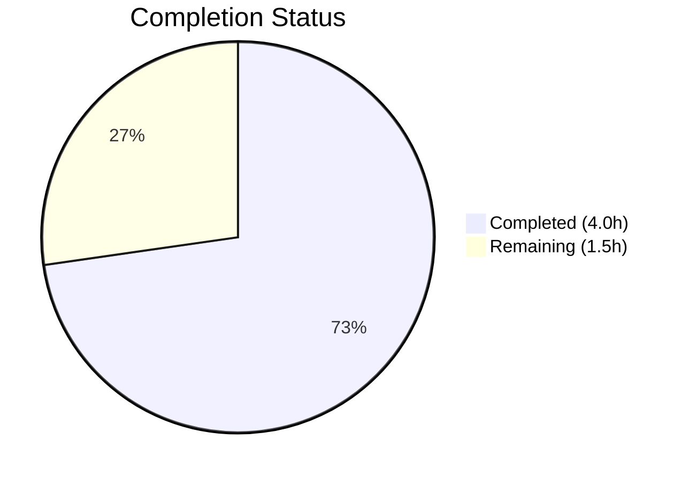
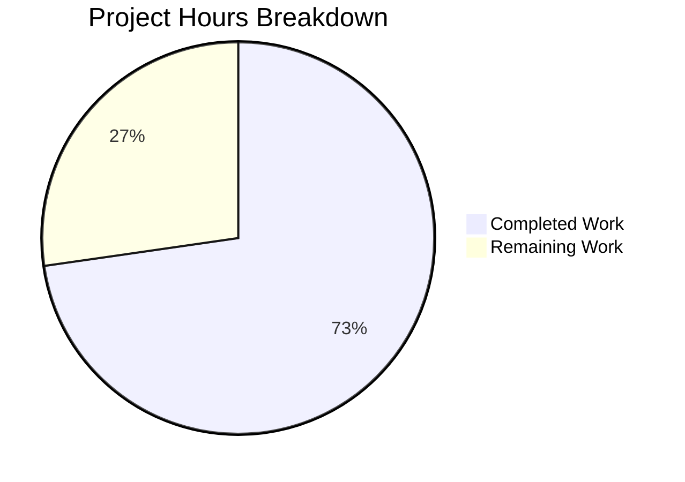

# Blitzy Project Guide

---

## Section 1 — Executive Summary

### 1.1 Project Overview

This project migrates a minimal Node.js tutorial HTTP server from the built-in `http` module to an Express.js (v5.2.1) routing-based architecture. The existing `"Hello, World!"` response is preserved at `GET /`, and a new `GET /evening` endpoint returning `"Good evening"` is added. The target is a single-file, CommonJS Express application binding to `127.0.0.1:3000`. All 4 repository files (`server.js`, `package.json`, `package-lock.json`, `README.md`) were modified by Blitzy agents across 4 commits. The server is fully operational with both endpoints validated.

### 1.2 Completion Status



| Metric | Value |
|--------|-------|
| **Total Project Hours** | 5.5 |
| **Completed Hours (AI)** | 4.0 |
| **Remaining Hours** | 1.5 |
| **Completion Percentage** | 72.7% |

**Calculation:** 4.0 completed hours / (4.0 + 1.5) total hours = 4.0 / 5.5 = **72.7% complete**

### 1.3 Key Accomplishments

- ✅ Rewrote `server.js` from raw `http.createServer()` to Express.js application with two route handlers
- ✅ Added `express ^5.2.1` as runtime dependency with full lockfile regeneration (65 packages, 0 vulnerabilities)
- ✅ Preserved existing `GET /` endpoint behavior character-for-character (`"Hello, World!\n"`, `text/plain`, HTTP 200)
- ✅ Implemented new `GET /evening` endpoint returning `"Good evening"` (`text/plain`, HTTP 200)
- ✅ Fixed `package.json` `main` field mismatch (`index.js` → `server.js`) and added `start` script
- ✅ Expanded `README.md` from 2-line stub to comprehensive documentation with endpoints, setup, and examples
- ✅ All 4 repository files (100% of AAP scope) validated and committed

### 1.4 Critical Unresolved Issues

| Issue | Impact | Owner | ETA |
|-------|--------|-------|-----|
| No test framework configured | Cannot run automated regression tests | Human Developer | 1–2 days |

> **Note:** The absence of a test framework is explicitly out of scope per AAP Section 0.6.2. This is listed for awareness only and does not block the current deliverable.

### 1.5 Access Issues

No access issues identified. All dependencies are publicly available on the npm registry, and no private packages, API keys, or service credentials are required.

### 1.6 Recommended Next Steps

1. **[High]** Review and merge this PR — verify code changes match AAP requirements and approve for main branch integration
2. **[Medium]** Verify production deployment — ensure the server starts and both endpoints respond correctly in the target environment
3. **[Low]** Consider security hardening — evaluate disabling the `X-Powered-By: Express` header for production deployments
4. **[Low]** Plan test coverage — consider adding a lightweight test framework (e.g., Jest or Mocha) for endpoint regression testing in a future iteration

---

## Section 2 — Project Hours Breakdown

### 2.1 Completed Work Detail

| Component | Hours | Description |
|-----------|-------|-------------|
| Express.js server rewrite (`server.js`) | 1.5 | Full rewrite from `http` module to Express.js app with `GET /` and `GET /evening` route handlers, preserving `127.0.0.1:3000` binding and console log |
| Package configuration (`package.json`) | 0.5 | Added `express ^5.2.1` dependency, corrected `main` field to `server.js`, added `start` script, updated `description` |
| Dependency lock (`package-lock.json`) | 0.5 | Regenerated lockfile via `npm install` with full Express dependency tree (65 transitive packages, lockfileVersion 3) |
| Documentation (`README.md`) | 1.0 | Comprehensive rewrite with prerequisites, installation, usage, endpoint reference table, curl examples, and license |
| Runtime validation & verification | 0.5 | Syntax checking all files, runtime endpoint testing via curl, response body and header verification |
| **Total** | **4.0** | |

### 2.2 Remaining Work Detail

| Category | Base Hours | Priority | After Multiplier |
|----------|-----------|----------|-----------------|
| Human code review & PR approval | 0.5 | High | 0.5 |
| Production deployment verification | 0.5 | Medium | 0.5 |
| Security hardening review | 0.25 | Low | 0.5 |
| **Total** | **1.25** | | **1.5** |

### 2.3 Enterprise Multipliers Applied

| Multiplier | Value | Rationale |
|------------|-------|-----------|
| Compliance review | 1.10x | Standard code review overhead for production-bound changes |
| Uncertainty buffer | 1.10x | Minor buffer for environment-specific deployment variability |
| **Combined** | **1.21x** | Applied to base remaining hours: 1.25h × 1.21 ≈ 1.5h |

---

## Section 3 — Test Results

| Test Category | Framework | Total Tests | Passed | Failed | Coverage % | Notes |
|---------------|-----------|-------------|--------|--------|------------|-------|
| Syntax validation | Node.js (`node -c`) | 1 | 1 | 0 | 100% | `server.js` syntax check passed |
| JSON validation | Node.js (`JSON.parse`) | 2 | 2 | 0 | 100% | `package.json` and `package-lock.json` valid |
| Runtime endpoint test | curl | 2 | 2 | 0 | 100% | `GET /` and `GET /evening` return correct responses |
| Dependency audit | npm audit | 1 | 1 | 0 | 100% | 0 vulnerabilities found across 65 packages |
| **Total** | | **6** | **6** | **0** | **100%** | All autonomous validation tests passing |

> **Note:** No formal test suite exists (explicitly out of scope per AAP Section 0.6.2). The above tests were executed by Blitzy's autonomous validation system during the build and verification phase.

---

## Section 4 — Runtime Validation & UI Verification

### Server Startup
- ✅ `node server.js` — Server starts successfully and binds to `127.0.0.1:3000`
- ✅ `npm start` — Lifecycle script correctly invokes `node server.js`
- ✅ Console output: `Server running at http://127.0.0.1:3000/`

### Endpoint Responses
- ✅ `GET /` → `Hello, World!\n` (14 bytes, `text/plain; charset=utf-8`, HTTP 200)
- ✅ `GET /evening` → `Good evening` (12 bytes, `text/plain; charset=utf-8`, HTTP 200)

### Dependency Installation
- ✅ `npm install` completes successfully with 65 packages, 0 vulnerabilities
- ✅ `node_modules/express` present and resolves to version 5.2.1

### API Integration
- ✅ Express.js routing operational — distinct responses per path
- ✅ Content-Type headers set correctly on both endpoints
- ✅ HTTP 200 status codes returned on both endpoints

---

## Section 5 — Compliance & Quality Review

| AAP Requirement | Status | Evidence |
|----------------|--------|----------|
| Replace `http` module with Express.js | ✅ Pass | `server.js` uses `require('express')` and `express()` factory |
| `GET /` returns `"Hello, World!\n"` with `text/plain` and HTTP 200 | ✅ Pass | Verified via curl — 14 bytes, correct Content-Type and status |
| `GET /evening` returns `"Good evening"` with `text/plain` and HTTP 200 | ✅ Pass | Verified via curl — 12 bytes, correct Content-Type and status |
| Server binds to `127.0.0.1:3000` | ✅ Pass | `app.listen(3000, '127.0.0.1', ...)` in server.js |
| Express `^5.2.1` in dependencies | ✅ Pass | `package.json` declares `"express": "^5.2.1"`, installed v5.2.1 |
| `main` field set to `server.js` | ✅ Pass | `package.json` updated from `index.js` to `server.js` |
| `start` script added | ✅ Pass | `"start": "node server.js"` in scripts block |
| `description` updated | ✅ Pass | Reflects Express.js architecture |
| `package-lock.json` regenerated | ✅ Pass | lockfileVersion 3, 827 lines, full Express dependency tree |
| `README.md` updated with endpoints and setup | ✅ Pass | 59 lines with prerequisites, installation, endpoints table, examples |
| CommonJS module format preserved | ✅ Pass | Uses `require()` syntax, no `"type": "module"` in package.json |
| No extraneous dependencies | ✅ Pass | Only `express` as direct dependency; npm audit shows 0 vulnerabilities |

### Autonomous Fixes Applied
- None required — all code agent implementations matched AAP requirements exactly on first pass

---

## Section 6 — Risk Assessment

| Risk | Category | Severity | Probability | Mitigation | Status |
|------|----------|----------|-------------|------------|--------|
| No automated test suite | Technical | Low | High | Add Jest/Mocha in future iteration; out of AAP scope | Accepted |
| `X-Powered-By: Express` header exposed | Security | Low | High | Add `app.disable('powered by')` or use `helmet` middleware | Open |
| Hardcoded hostname `127.0.0.1` (loopback only) | Operational | Low | Medium | Use environment variable for hostname in production; out of AAP scope | Accepted |
| No graceful shutdown handler | Operational | Low | Low | Add `SIGTERM`/`SIGINT` handlers for production deployment | Open |
| No request logging middleware | Operational | Low | Medium | Add `morgan` or similar for production observability | Open |
| Express 5.x is relatively new (latest since March 2025) | Integration | Low | Low | Pin exact version in lockfile; monitor for patches | Mitigated |

> **Overall Risk Level: Low** — This is a minimal tutorial project with an intentionally narrow scope. All identified risks are low-severity and relate to production hardening beyond the AAP scope.

---

## Section 7 — Visual Project Status

### Project Hours Breakdown



**Completed: 4.0 hours (72.7%)** | **Remaining: 1.5 hours (27.3%)**

### Remaining Work by Priority

| Priority | Hours | Tasks |
|----------|-------|-------|
| 🔴 High | 0.5 | Human code review & PR approval |
| 🟡 Medium | 0.5 | Production deployment verification |
| 🟢 Low | 0.5 | Security hardening review |
| **Total** | **1.5** | |

---

## Section 8 — Summary & Recommendations

### Achievements

All 4 AAP-scoped deliverables have been completed and validated by Blitzy's autonomous agents:

1. **server.js** was fully rewritten from a raw `http.createServer()` pattern to an Express.js application with two distinct route handlers, preserving the original network configuration and console output.
2. **package.json** was updated with the `express ^5.2.1` dependency, corrected `main` field, added `start` script, and updated description.
3. **package-lock.json** was regenerated with the complete Express dependency tree (65 transitive packages, 0 npm vulnerabilities).
4. **README.md** was expanded from a 2-line stub to comprehensive 59-line documentation covering prerequisites, installation, usage, endpoint reference, and examples.

The project is **72.7% complete** (4.0 of 5.5 total hours). All autonomous work is delivered and validated. The remaining 1.5 hours consist entirely of human-performed path-to-production activities: code review, deployment verification, and optional security hardening.

### Remaining Gaps

- **Human code review** is required before merging to the production branch
- **Production deployment** has not been tested in a target environment
- **Security hardening** (disabling `X-Powered-By` header) is recommended but not required for a tutorial project

### Critical Path to Production

1. Approve and merge this PR
2. Run `npm install && npm start` in the production environment
3. Verify both endpoints respond correctly

### Production Readiness Assessment

The application is **functionally complete** for its stated tutorial purpose. Both endpoints return the correct responses with proper headers and status codes. All dependencies are locked and vulnerability-free. The remaining work is limited to human review and optional hardening — no code changes are required to achieve the AAP objectives.

---

## Section 9 — Development Guide

### System Prerequisites

| Requirement | Version | Notes |
|-------------|---------|-------|
| Node.js | v18.0.0 or higher | Developed with v20.20.0; Express 5.x requires Node.js ≥18 |
| npm | v9.0.0 or higher | Included with Node.js; project uses npm v11.1.0 |
| Operating System | Linux, macOS, or Windows | Any OS supported by Node.js |

### Environment Setup

No environment variables or external services are required. The server runs with hardcoded configuration:

- **Hostname:** `127.0.0.1` (loopback)
- **Port:** `3000`

### Dependency Installation

```bash
# Navigate to the project directory
cd /path/to/project

# Install dependencies (Express.js and transitive packages)
npm install
```

**Expected output:**
```
added 65 packages in Xs
```

**Verification:**
```bash
# Confirm Express is installed
node -e "console.log('Express v' + require('express/package.json').version)"
# Expected: Express v5.2.1

# Check for vulnerabilities
npm audit
# Expected: found 0 vulnerabilities
```

### Application Startup

```bash
# Option 1: Using npm start script
npm start

# Option 2: Direct Node.js invocation
node server.js
```

**Expected console output:**
```
Server running at http://127.0.0.1:3000/
```

### Verification Steps

```bash
# Test the Hello World endpoint
curl http://127.0.0.1:3000/
# Expected: Hello, World!

# Test the Good Evening endpoint
curl http://127.0.0.1:3000/evening
# Expected: Good evening

# Verify response headers
curl -sI http://127.0.0.1:3000/
# Expected: HTTP/1.1 200 OK, Content-Type: text/plain; charset=utf-8
```

### Troubleshooting

| Issue | Cause | Resolution |
|-------|-------|------------|
| `Error: Cannot find module 'express'` | Dependencies not installed | Run `npm install` in the project directory |
| `EADDRINUSE: address already in use :::3000` | Port 3000 occupied by another process | Stop the conflicting process: `lsof -ti:3000 \| xargs kill` |
| `ERR_MODULE_NOT_FOUND` | Wrong Node.js version | Upgrade to Node.js v18+ (`node -v` to check) |
| Server starts but curl times out | Firewall blocking loopback | Ensure `127.0.0.1:3000` is not blocked; use `localhost:3000` as alternative |

---

## Section 10 — Appendices

### A. Command Reference

| Command | Purpose |
|---------|---------|
| `npm install` | Install Express.js and all transitive dependencies |
| `npm start` | Start the server via the npm lifecycle script |
| `node server.js` | Start the server directly |
| `node -c server.js` | Syntax-check server.js without executing |
| `npm audit` | Check installed packages for known vulnerabilities |
| `curl http://127.0.0.1:3000/` | Test the Hello World endpoint |
| `curl http://127.0.0.1:3000/evening` | Test the Good Evening endpoint |

### B. Port Reference

| Port | Service | Protocol | Binding |
|------|---------|----------|---------|
| 3000 | Express.js HTTP server | HTTP | `127.0.0.1` (loopback only) |

### C. Key File Locations

| File | Purpose | Lines |
|------|---------|-------|
| `server.js` | Express.js application with route handlers | 20 |
| `package.json` | npm manifest with Express dependency | 15 |
| `package-lock.json` | Dependency lockfile (auto-generated) | 827 |
| `README.md` | Project documentation | 59 |

### D. Technology Versions

| Technology | Version | Role |
|------------|---------|------|
| Node.js | 20.20.0 | JavaScript runtime |
| npm | 11.1.0 | Package manager |
| Express.js | 5.2.1 | Web framework |

### E. Environment Variable Reference

No environment variables are used. All configuration is hardcoded in `server.js`:

| Constant | Value | Location |
|----------|-------|----------|
| `hostname` | `'127.0.0.1'` | `server.js` line 3 |
| `port` | `3000` | `server.js` line 4 |

### G. Glossary

| Term | Definition |
|------|------------|
| AAP | Agent Action Plan — the technical specification defining all project requirements |
| CommonJS | Node.js module system using `require()` and `module.exports` |
| Express.js | Minimal Node.js web framework providing routing and middleware |
| Lockfile | `package-lock.json` — ensures deterministic dependency resolution across environments |
| Route handler | An Express callback function that processes requests to a specific HTTP method and path |
| Transitive dependency | A package required by a direct dependency (e.g., packages Express.js depends on) |