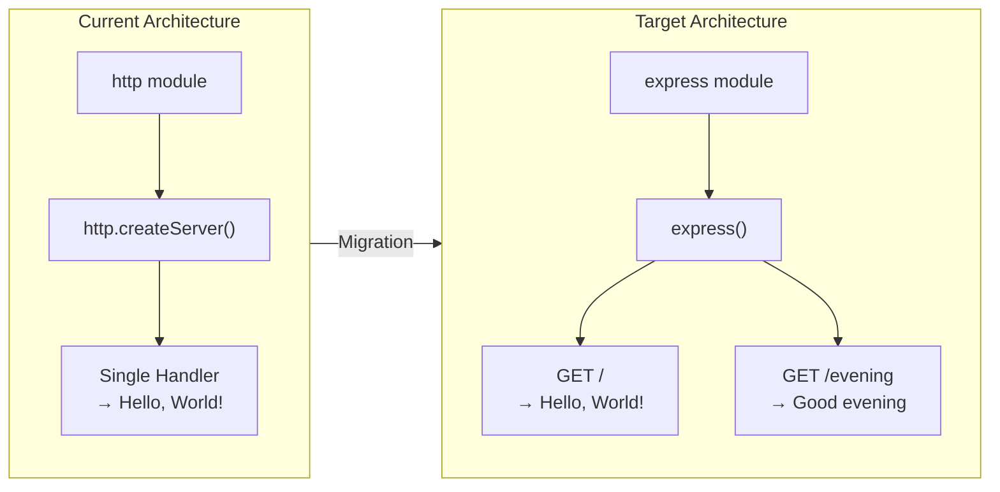

# Technical Specification

# 0. Agent Action Plan

## 0.1 Intent Clarification


### 0.1.1 Core Feature Objective

Based on the prompt, the Blitzy platform understands that the new feature requirement is to:

- **Integrate the Express.js web framework** into an existing minimal Node.js HTTP server project that currently uses only the built-in `http` module with zero third-party dependencies.
- **Add a new HTTP endpoint** that returns the plain-text response `"Good evening"` when accessed, alongside the existing `"Hello, World!"` response behavior.
- **Migrate the server architecture** from a raw `http.createServer()` pattern (which handles all requests uniformly) to an Express.js routing-based architecture that can serve distinct responses on different routes.

The implicit requirements detected from this request include:

- The existing `"Hello, World!"` response must be preserved and routed to a dedicated endpoint (e.g., `GET /`) rather than acting as a catch-all for every HTTP method and path.
- The project's `package.json` must be updated to declare `express` as a runtime dependency, transitioning the project from a zero-dependency architecture to a single-dependency setup.
- The `package-lock.json` must be regenerated to reflect the full Express.js dependency tree.
- The `server.js` file must be rewritten to use Express.js idioms (`app.get()`, `app.listen()`) instead of the low-level `http.createServer()` API.
- The server must continue to bind to `127.0.0.1` on port `3000` to preserve the existing network configuration.

### 0.1.2 Special Instructions and Constraints

- **No specific version constraint** was provided by the user for Express.js. The latest stable version available on npm is **Express 5.2.1**, which is compatible with the project's Node.js 20.20.0 runtime (Express 5 requires Node.js ≥18).
- **Backward compatibility** with the existing `"Hello, World!"` endpoint behavior must be maintained — the response body, content type, and HTTP status code must remain identical.
- **Tutorial-oriented simplicity** — the user describes this as a tutorial project, so the implementation should remain concise, readable, and educational.
- **CommonJS module format** must be preserved — the existing project uses `require()` syntax (no ES Modules), and the Express.js integration must follow the same pattern.

### 0.1.3 Technical Interpretation

These feature requirements translate to the following technical implementation strategy:

- To **integrate Express.js**, we will install the `express` npm package (version `^5.2.1`) as a runtime dependency, update `package.json` with a `dependencies` block, and regenerate `package-lock.json` to lock the full dependency tree.
- To **add the "Good evening" endpoint**, we will define a new Express route handler using `app.get('/evening', ...)` that responds with the plain-text string `"Good evening"`.
- To **preserve the existing "Hello, World!" endpoint**, we will migrate the current catch-all request handler in `server.js` to a dedicated Express route at `GET /` that returns `"Hello, World!\n"` with `Content-Type: text/plain` and HTTP 200.
- To **rewrite server.js**, we will replace the `http.createServer()` pattern with the Express `express()` application factory, define route handlers for both endpoints, and use `app.listen(port, hostname, callback)` to bind the server to the same `127.0.0.1:3000` address.
- To **update project metadata**, we will add a `start` script to `package.json` (`"start": "node server.js"`) to provide a standard npm lifecycle command for running the server, and update the `description` field to reflect the new Express-based architecture.
- To **update documentation**, we will revise `README.md` to reflect the project's new Express.js dependency and the availability of two endpoints.


## 0.2 Repository Scope Discovery


### 0.2.1 Comprehensive File Analysis

The repository is a minimal, four-file Node.js project at the root level with no subdirectories. Every file in the repository has been inspected and evaluated for its relevance to the Express.js integration task.

**Existing Files Requiring Modification:**

| File | Current Purpose | Modification Required | Rationale |
|---|---|---|---|
| `server.js` | Sole runtime file; creates HTTP server via `http.createServer()` with a fixed "Hello, World!" response for all requests | **REWRITE** — Replace `http` module usage with Express.js application; add route-based endpoint handlers | Core of the feature integration; transforms from raw HTTP to Express routing |
| `package.json` | npm manifest; declares package identity (`hello_world`, v1.0.0); zero dependencies; placeholder test script | **MODIFY** — Add `express` to `dependencies`; add `start` script; update `description` and `main` field | Express must be declared as a runtime dependency; `main` should point to `server.js` |
| `package-lock.json` | Lockfile (v3); confirms empty dependency graph with only root package metadata | **REGENERATE** — Will be automatically regenerated by `npm install express` to include Express and its transitive dependencies | Required to lock deterministic dependency resolution |
| `README.md` | Governance document; identifies project as `hao-backprop-test` with "Do not touch!" directive | **MODIFY** — Update to document Express.js integration, available endpoints, and setup instructions | Must reflect the new architecture and usage instructions |

**Integration Point Discovery:**

- **API endpoints**: Currently none (all requests return the same response). Express.js introduces route-based endpoints:
  - `GET /` — Returns `"Hello, World!\n"` (preserves existing behavior)
  - `GET /evening` — Returns `"Good evening"` (new endpoint)
- **Database models/migrations**: Not applicable — no database in this project.
- **Service classes**: Not applicable — single-file server with no service layer.
- **Controllers/handlers**: The request handler callback in `server.js` (lines 6–10) is the sole handler and will be replaced by Express route handlers.
- **Middleware/interceptors**: Not applicable in the current codebase, though Express.js inherently provides middleware support for future extensibility.

### 0.2.2 New File Requirements

No new source files need to be created for this feature. The existing `server.js` will be rewritten in place to incorporate Express.js, and all other changes are modifications to existing files. The rationale is:

- The project is a minimal tutorial-style application; introducing a multi-file architecture (e.g., separate `routes/`, `controllers/` directories) would contradict the project's simplicity and the user's tutorial intent.
- Both endpoints (`/` and `/evening`) are simple enough to coexist within a single `server.js` file.
- No test framework is configured or requested, so no new test files are required.
- No new configuration files are needed — Express.js does not require separate configuration beyond what is defined in `server.js`.

### 0.2.3 Web Search Research Conducted

The following research was conducted to inform the implementation plan:

- **Express.js latest stable version**: Confirmed via npm registry and the official Express.js GitHub releases page that Express 5.2.1 is the current `latest`-tagged version on npm. Express 5.1.0 was promoted to the default npm `latest` tag in March 2025.
- **Express 5 Node.js compatibility**: Express 5 dropped support for Node.js versions before v18. The project's Node.js 20.20.0 runtime is fully compatible.
- **Express 5 CommonJS support**: Express 5 continues to support CommonJS `require()` imports, maintaining compatibility with the project's module system.
- **Express 5 breaking changes from v4**: Updated path-to-regexp, removed deprecated API methods from v3/v4, and added native async/await error handling in middleware. None of these affect a fresh integration.


## 0.3 Dependency Inventory


### 0.3.1 Private and Public Packages

The project currently has zero dependencies. The Express.js integration introduces one new public runtime dependency and its transitive dependency tree.

| Registry | Package Name | Version | Type | Purpose |
|---|---|---|---|---|
| npm | `express` | `^5.2.1` | `dependencies` (runtime) | Web framework providing routing, middleware pipeline, and HTTP utilities to replace the raw `http.createServer()` pattern |

**Transitive Dependencies:** Express 5.x brings its own dependency tree including packages such as `body-parser`, `content-disposition`, `cookie`, `debug`, `depd`, `encodeurl`, `finalhandler`, `merge-descriptors`, `methods`, `mime-types`, `on-finished`, `path-to-regexp`, `qs`, `send`, `serve-static`, `statuses`, `type-is`, and others. These are resolved and locked automatically by npm and recorded in `package-lock.json`.

**Removed Dependencies:** The Node.js built-in `http` module import (`require('http')`) in `server.js` will no longer be needed, as Express.js manages HTTP server creation internally via `app.listen()`.

### 0.3.2 Dependency Updates

**Import Updates:**

The sole executable file, `server.js`, requires an import transformation:

- **Remove**: `const http = require('http');` — The built-in `http` module is no longer directly consumed.
- **Add**: `const express = require('express');` — The Express module replaces the raw HTTP API.

No other files in the repository contain imports that need updating.

**External Reference Updates:**

| File | Update Required |
|---|---|
| `package.json` | Add `"dependencies": { "express": "^5.2.1" }`; add `"start": "node server.js"` to `scripts`; update `"main"` from `"index.js"` to `"server.js"`; update `"description"` |
| `package-lock.json` | Fully regenerated by `npm install` to include Express and all transitive dependencies |
| `README.md` | Document the new `express` dependency, installation steps (`npm install`), and updated usage instructions |

### 0.3.3 Runtime and Tooling Versions

| Tool | Version | Source |
|---|---|---|
| Node.js | 20.20.0 | Installed runtime (inferred from lockfileVersion 3 requiring npm ≥9, shipped with Node.js ≥18) |
| npm | 11.1.0 | Installed package manager |
| Express.js | ^5.2.1 | npm registry latest stable (to be added) |


## 0.4 Integration Analysis


### 0.4.1 Existing Code Touchpoints

**Direct Modifications Required:**

- **`server.js` (lines 1–14, full rewrite):** The entire file must be rewritten to replace the `http.createServer()` pattern with an Express.js application. Specifically:
  - Line 1: Replace `const http = require('http');` with `const express = require('express');`
  - Lines 3–4: Retain the `hostname` and `port` constants (`'127.0.0.1'` and `3000`) for the Express `app.listen()` call
  - Lines 6–10: Replace the single catch-all request handler with two distinct Express route handlers:
    - `app.get('/', ...)` for the existing `"Hello, World!\n"` response
    - `app.get('/evening', ...)` for the new `"Good evening"` response
  - Lines 12–14: Replace `server.listen(port, hostname, callback)` with `app.listen(port, hostname, callback)` preserving the same startup console log

- **`package.json` (lines 2, 4, 5, 6–8):** Targeted field updates:
  - Line 4 (`"description"`): Update from `"Hello world in Node.js"` to reflect Express-based architecture
  - Line 5 (`"main"`): Change from `"index.js"` to `"server.js"` to correctly point to the executable entry file
  - Lines 6–8 (`"scripts"`): Add a `"start": "node server.js"` script for standard npm lifecycle support
  - After line 8: Add `"dependencies": { "express": "^5.2.1" }` block

- **`README.md` (lines 1–2):** Expand documentation to describe Express.js integration, list the two available endpoints, and provide setup/run instructions.

**Dependency Injections:**

Not applicable — the project has no dependency injection container, service registry, or IoC framework. Express.js is integrated directly via `require('express')` in `server.js`.

**Database/Schema Updates:**

Not applicable — no database, ORM, or data persistence layer exists in this project.

### 0.4.2 Architecture Transition Diagram

The following diagram illustrates the architectural transition from the raw `http` module pattern to the Express.js routing pattern:



### 0.4.3 Endpoint Integration Map

| Endpoint | HTTP Method | Response Body | Content-Type | Status Code | Source |
|---|---|---|---|---|---|
| `/` | GET | `Hello, World!\n` | `text/plain` | 200 | Migrated from existing catch-all handler in `server.js` lines 6–10 |
| `/evening` | GET | `Good evening` | `text/plain` | 200 | New endpoint per user requirement |


## 0.5 Technical Implementation


### 0.5.1 File-by-File Execution Plan

**Group 1 — Core Feature File:**

- **MODIFY: `server.js`** — Rewrite the server implementation to use Express.js
  - Replace `require('http')` with `require('express')`
  - Create an Express application instance via `const app = express();`
  - Define `GET /` route returning `"Hello, World!\n"` with `Content-Type: text/plain`
  - Define `GET /evening` route returning `"Good evening"` with `Content-Type: text/plain`
  - Bind the server using `app.listen(port, hostname, callback)` with the same `127.0.0.1:3000` configuration
  - Preserve the startup console log message

**Group 2 — Package Configuration:**

- **MODIFY: `package.json`** — Update project metadata and declare Express dependency
  - Add `"dependencies": { "express": "^5.2.1" }`
  - Update `"main"` from `"index.js"` to `"server.js"`
  - Add `"start": "node server.js"` to the `"scripts"` block
  - Update `"description"` to reflect the Express-based architecture
- **REGENERATE: `package-lock.json`** — Automatically regenerated by running `npm install` after updating `package.json`; locks the full Express dependency tree

**Group 3 — Documentation:**

- **MODIFY: `README.md`** — Update project documentation
  - Add project description reflecting Express.js integration
  - Document available endpoints (`GET /` and `GET /evening`)
  - Add setup instructions (`npm install` followed by `npm start` or `node server.js`)

### 0.5.2 Implementation Approach per File

**`server.js` — Express.js Server Rewrite:**

The file will be transformed from a 14-line raw HTTP server to an Express.js application of similar length. The key structural changes are:

```javascript
const express = require('express');
const app = express();
```

Two route handlers will be defined using Express's declarative routing API, each responding with plain text. The `app.listen()` call replaces `server.listen()` with identical parameters (port, hostname, callback).

**`package.json` — Dependency Declaration:**

The manifest gains a `dependencies` object and an updated `scripts` block:

```json
"dependencies": { "express": "^5.2.1" }
```

The `main` field correction from `index.js` to `server.js` resolves a pre-existing mismatch identified in the tech spec (Section 5.2.2), where the declared entry point did not match the actual executable file.

**`package-lock.json` — Dependency Lock Regeneration:**

This file is not manually edited. Running `npm install` after the `package.json` update will produce a new lockfile containing the resolved Express dependency tree with integrity hashes, ensuring deterministic installs across environments.

**`README.md` — Documentation Update:**

The README will be expanded from its current 2-line governance-only format to include project purpose, prerequisites (Node.js ≥18), installation steps, how to start the server, and a list of available endpoints with their expected responses.


## 0.6 Scope Boundaries


### 0.6.1 Exhaustively In Scope

All files requiring creation or modification for this feature addition are listed below. Since the repository contains only four files at the root level with no subdirectories, wildcard patterns are not applicable — the scope is enumerated exhaustively.

**Source Files:**

- `server.js` — Full rewrite to Express.js application with two route handlers (`GET /` and `GET /evening`)

**Package Configuration:**

- `package.json` — Add `express` dependency, update `main`, `description`, and `scripts` fields
- `package-lock.json` — Regenerated automatically by `npm install` to lock the Express dependency tree

**Documentation:**

- `README.md` — Updated to document Express.js integration, endpoints, setup, and usage

**Summary of Scope:**

| File | Action | Lines Affected |
|---|---|---|
| `server.js` | REWRITE | All 14 lines (complete replacement) |
| `package.json` | MODIFY | Lines 4–8 (description, main, scripts) + new `dependencies` block |
| `package-lock.json` | REGENERATE | Entire file (auto-generated by npm) |
| `README.md` | MODIFY | All 2 lines (expand to comprehensive documentation) |

**Total Files In Scope:** 4 of 4 repository files (100% coverage)

### 0.6.2 Explicitly Out of Scope

The following items are explicitly excluded from this feature addition:

- **Test framework setup** — No test framework (Jest, Mocha, etc.) is configured or requested; the existing placeholder `"test"` script in `package.json` will remain unless a `start` script coexists with it
- **Middleware configuration** — No request parsing middleware (e.g., `body-parser`, `cors`) is needed for the two plain-text GET endpoints
- **Error handling middleware** — No custom Express error handler is required for this minimal tutorial; Express default error handling is sufficient
- **Static file serving** — No static assets are served; `express.static()` is not needed
- **HTTPS/TLS configuration** — The server will continue to operate over plain HTTP on loopback
- **Environment variable configuration** — The hostname and port remain hardcoded constants, consistent with the project's tutorial nature
- **Docker/containerization** — No Dockerfile or docker-compose configuration is involved
- **CI/CD pipeline configuration** — No GitHub Actions, GitLab CI, or other CI/CD pipelines exist or are requested
- **Database integration** — No database, ORM, or data persistence layer is involved
- **Authentication/authorization** — No auth mechanisms are needed for this tutorial project
- **TypeScript migration** — The project remains in plain JavaScript with CommonJS modules
- **Clustering or scaling** — The server continues to run as a single Node.js process


## 0.7 Rules for Feature Addition


### 0.7.1 Feature-Specific Rules

The following rules govern the Express.js integration and new endpoint addition:

- **Preserve existing behavior**: The `GET /` endpoint must return exactly `"Hello, World!\n"` with `Content-Type: text/plain` and HTTP 200, matching the current `server.js` response behavior character-for-character (including the trailing newline).
- **Exact response text for new endpoint**: The `GET /evening` endpoint must return exactly `"Good evening"` as specified by the user. No additional formatting, newlines, or embellishments should be added unless explicitly matching the user's phrasing.
- **CommonJS module format**: All code must use `require()` / `module.exports` syntax. Do not introduce ES Module `import`/`export` syntax or add `"type": "module"` to `package.json`.
- **Maintain network configuration**: The server must continue to bind to `127.0.0.1` on port `3000`. Do not change the hostname or port values.
- **Tutorial simplicity**: Keep the implementation concise and readable. The rewritten `server.js` should remain a single-file, self-contained Express application without extracting routes into separate modules or introducing unnecessary abstractions.
- **Semantic versioning for Express**: Use caret range (`^5.2.1`) in `package.json` to allow compatible minor and patch updates while pinning the minimum version.
- **No extraneous dependencies**: Only `express` should be added as a direct dependency. Do not add utility packages, middleware, or dev dependencies that are not required for the two GET endpoints.


## 0.8 References


### 0.8.1 Repository Files and Folders Searched

The following files and folders were inspected during the analysis of this feature addition. The repository contains four files at the root level with no subdirectories.

| Path | Type | Inspection Method | Key Findings |
|---|---|---|---|
| `/` (root) | Folder | `get_source_folder_contents` | Four files, no subdirectories; minimal Node.js HTTP server fixture |
| `server.js` | File | `read_file` (lines 1–14) | 14-line HTTP server using `http.createServer()`; single catch-all handler returning "Hello, World!" |
| `package.json` | File | `read_file` (lines 1–11) | npm manifest for `hello_world` v1.0.0; zero dependencies; `main` set to `index.js` (mismatch with `server.js`) |
| `package-lock.json` | File | `read_file` (lines 1–13) | lockfileVersion 3; empty dependency graph; root-only package metadata |
| `README.md` | File | `read_file` (lines 1–2) | Project identity (`hao-backprop-test`) and governance directive ("Do not touch!") |

### 0.8.2 Technical Specification Sections Reviewed

| Section | Purpose of Review |
|---|---|
| 1.1 Executive Summary | Understand project purpose as a Backprop integration test fixture |
| 2.1 Feature Catalog | Identify all existing features (F-001 through F-007) and their dependencies |
| 3.1 Programming Languages | Confirm JavaScript (ES6+) with CommonJS as sole language |
| 3.2 Runtime Platform | Verify Node.js runtime details and lockfile version implications |
| 3.3 Frameworks & Libraries | Document the intentional absence of frameworks (Express now being added) |
| 3.4 Open Source Dependencies | Confirm the zero-dependency architecture being transitioned |
| 5.2 Component Details | Understand the server lifecycle, component interactions, and request-response flow |

### 0.8.3 External Research Conducted

| Source | Query / URL | Finding |
|---|---|---|
| npm Registry | `npm view express version` | Latest stable version: 5.2.1 |
| GitHub Releases | expressjs/express releases page | Express v5 officially released; requires Node.js ≥18 |
| Express.js Blog | expressjs.com/2025/03/31/v5-1-latest-release | Express 5.1.0 promoted to npm `latest` tag in March 2025; LTS schedule announced |
| npm Versions | `npm view express@4 version` | Express 4.x latest: 4.22.1 (maintenance phase) |

### 0.8.4 Attachments and External Assets

No attachments were provided for this project. No Figma URLs, design mockups, or external asset files were referenced in the user's request.


